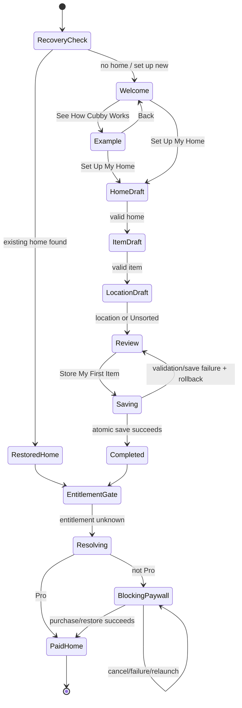

# Cubby First-Value Onboarding and Example Home Plan

Status: decision-ready  
Owners: Product + iOS  
Related: [#98](https://github.com/barronlroth/Cubby/issues/98), [#99](https://github.com/barronlroth/Cubby/issues/99), [#95](https://github.com/barronlroth/Cubby/issues/95)  
Research date: 2026-07-24

## Executive decision

Cubby should guide every new user toward one real, searchable inventory item before showing the required subscription wall.

The real-home path and example-home path should coexist, but not as equal setup choices:

- **Primary path:** set up a real home, name one real item, choose where it lives, review the path, and save all three together.
- **Secondary path:** a short, clearly labeled, original Cubby example that demonstrates search revealing an item's location, then returns to real setup.
- **Rejected:** a peer first-screen branch into four persistent or trademark-inspired sample homes.

The example can explain Cubby, but it cannot activate Cubby. The product's first value is a user later finding one of their own things. A peer sample branch adds choice before understanding, risks false activation, creates CloudKit/gating/telemetry complexity, and encourages copyrighted or trademark-dependent content.

Use an original setting such as **Juniper House**:

- `Entryway > Console Drawer > Spare Keys`
- `Bedroom > Closet > Top Shelf > Passport`
- `Utility Closet > Blue Bin > AA Batteries`

The example is bundled read-only data. It is never written to Core Data, never synced, never counted as a home/item, and never sent through inventory analytics.

## Why this is a product decision, not a low-risk UI patch

Current Cubby completes onboarding immediately after `createHome`, then presents the hard paywall to a resolved non-Pro user:

- `OnboardingView` creates a home and sets `hasCompletedOnboarding = true`.
- `LaunchContentView` also marks onboarding complete whenever it sees any existing home.
- `CoreDataAppRepository.createHome` immediately saves the home plus `Unsorted`.
- `HomeSearchContainer` owns `ProAccessManager` and the blocking paywall, so entitlement resolution does not begin at the onboarding root.
- Current UI tests assert that onboarding ends on an empty home and that a free user sees the blocking trial wall immediately after naming the home.

Implementing the recommended flow therefore changes the activation/paywall boundary and needs an atomic setup transaction or a broader resumable-onboarding state model. That is consequential enough to require TL approval before production code.

## Goals

- Make Cubby's core model obvious: `Home > Location > Item > Searchable memory`.
- Get the user to one real stored item before asking them to subscribe.
- Demonstrate the search payoff without polluting real inventory.
- Preserve existing-home recovery and CloudKit safety.
- Preserve the current native SwiftUI visual contract, hard-paywall mechanics, trial metadata, restore/manage/legal affordances, and accessibility baseline.
- Produce measurable, privacy-safe activation milestones when #95 adds telemetry.

## Non-goals

- Account creation.
- Mandatory camera, photo-library, notification, contacts, or location permission.
- A floor-plan or room-mapping flow.
- Import/export as a mainstream first-run path.
- Multiple sample worlds.
- Copying sample data into a user's inventory.
- Trademark-inspired Hogwarts, Mario, ARC Raiders, celebrity-home, or other media sample content.
- A permanent free tier. [Issue #116](https://github.com/barronlroth/Cubby/issues/116) confirms that free-tier listing language is stale after the hard-paywall change.

## Evidence

### Current Cubby behavior

| Evidence | Current behavior | Implication |
| --- | --- | --- |
| `Cubby/Views/Onboarding/OnboardingView.swift:3-85` | One scrollable screen asks for a home name, creates it, and immediately completes onboarding. | Current onboarding does not teach item placement or deliver first value. |
| `Cubby/CubbyApp.swift:365-429` | Recovery runs before fresh onboarding; any loaded home can auto-complete onboarding. | Preserve recovery ordering. Do not persist a partial onboarding home unless launch state is redesigned. |
| `Cubby/AppData/CoreDataAppRepository.swift:70-99` | `createHome` saves the home and default `Unsorted` location immediately. | The preferred design needs a dedicated atomic setup commit. |
| `Cubby/Services/HardPaywallPolicy.swift:15-32` | Incomplete onboarding is allowed; completed non-Pro onboarding is blocked. | The policy already supports a first-item-before-wall boundary if completion moves to successful setup commit. |
| `Cubby/Views/Home/HomeSearchContainer.swift:12-29,55-107` | RevenueCat state and paywall presentation are owned below onboarding. | Elevate manager ownership so entitlement and offerings can resolve while onboarding proceeds. |
| `CubbyUITests/CoreUserBehaviorUITests.swift:9-24` | Test expects `No Items` after first home creation. | Replace with a test that expects the first real item and path. |
| `CubbyUITests/CoreUserBehaviorUITests.swift:231-256` | Forced-free onboarding shows a non-dismissible trial wall after home naming. | Move this assertion to after the first atomic item commit. |
| `CubbyUITests/OnboardingAccessibilityUITests.swift:9-36` | Accessibility XXXL plus keyboard completion is protected. | Expand this contract across every onboarding input step. |
| `DESIGN.md` and `docs/design-system.md` | Warm cream canvas, semantic Cubby typography/color/spacing, 44-point controls, scrollable keyboard-safe onboarding, Reduce Motion. | New UI adopts the existing contract; the campaign paywall remains its documented exception. |

### GitHub history: proposal versus shipped code

| Item | Status | What it contributes |
| --- | --- | --- |
| [#98 — guided first-home and first-item onboarding](https://github.com/barronlroth/Cubby/issues/98) | Open proposal; not shipped | Correctly identifies first home + first item + meaningful location as activation and says not to paywall before the first stored item. Its equal two-button fork and four media-inspired homes are superseded by this plan. |
| [#99 — sample home](https://github.com/barronlroth/Cubby/issues/99) | Open proposal; not shipped | Defines the safer bundled, read-only, non-persistent option and the need to exclude examples from CloudKit, limits, and telemetry. |
| [#95 — privacy-preserving telemetry](https://github.com/barronlroth/Cubby/issues/95) | Open proposal; no analytics implementation found | Defines first home, first location, first item, inventory growth, and paywall reason as desired milestones. |
| [PR #1 — original app](https://github.com/barronlroth/Cubby/pull/1) | Merged/current product shape | Introduced the one-home-field first run. It did not add first-item or sample exploration. |
| [PR #110 — hard paywall trial](https://github.com/barronlroth/Cubby/pull/110) | Merged/current policy | Established a non-dismissible paywall after onboarding, metadata-driven trial copy, and restore/manage/legal paths. |
| [PR #117 — design system](https://github.com/barronlroth/Cubby/pull/117) | Merged/current visual contract | Added semantic tokens and validation; explicitly infrastructure and consistency work, not an onboarding redesign. |
| [#89](https://github.com/barronlroth/Cubby/issues/89) / [PR #91](https://github.com/barronlroth/Cubby/pull/91) | Shipped | Existing location creation and auto-selection can inform later implementation. |
| [PR #57 — last-used location](https://github.com/barronlroth/Cubby/pull/57) | Shipped | General add-item behavior has `Unsorted` fallback; onboarding must intentionally teach a meaningful path. |
| [#7 — camera option](https://github.com/barronlroth/Cubby/issues/7) | Open | Direct camera capture remains unresolved, reinforcing that photo capture must not gate activation. |
| [#16](https://github.com/barronlroth/Cubby/issues/16) / [PR #109](https://github.com/barronlroth/Cubby/pull/109) | Shipped advanced workflow | JSON import/export is useful after activation, not a first-run substitute. |

No new issue is needed. #98 owns onboarding, #99 owns example-home behavior, and #95 owns telemetry.

### Mobbin research

Mobbin flows were reviewed as interaction sequences, not just metadata. The relevant patterns are:

| App / flow | Observed pattern | Cubby conclusion |
| --- | --- | --- |
| [Google Home onboarding](https://mobbin.com/flows/886d66a9-6308-4998-8df3-f07ab8026ea7) and [Creating home](https://mobbin.com/flows/d66db33f-7b86-472e-976a-280e2a22d1e5) | Authentication is followed by an empty destination with a direct `Create home` CTA. Home setup uses Back, optional Skip for address, and returns to a real created home. | Keep home setup concrete and reversible. Ask only for data needed for Cubby's value; no address or system permission. |
| [SmartThings onboarding](https://mobbin.com/flows/997a7e22-2a7a-4ad4-ba77-928b75e9a425) | A skippable feature carousel lands on a dashboard with a contextual `Get started` card. | Do not force generic education. If setup is deferred, keep a clear in-product continuation, but Cubby's paid boundary makes real setup preferable before the wall. |
| [Numo first task](https://mobbin.com/flows/96c4f619-f8e8-41f2-8789-c255a52c61fa) | The user types a genuine first task inside onboarding; progress is visible; onboarding can be skipped. | Guided creation is stronger than a passive sample. Cubby's first item should be real and drafted in the flow. |
| [Asana onboarding](https://mobbin.com/flows/ef3f718e-cfde-40ec-bebd-7f34a7147208) | A real first project is created mid-flow; optional teammate invitation is explicitly skippable; the app lands with that project visible. | Required first-value data comes before optional expansion. Cubby should land with the created item visible after purchase/restore. |
| [eBay manual item](https://mobbin.com/flows/e56d23c3-076b-4cfd-b3fd-d8b984deb214) and [collection item](https://mobbin.com/flows/c4197ef5-356e-48e4-8c8c-b9626ea40e46) | Empty collection has one prominent `Add item`; required fields are separated from recommended fields; photos and details can be added later; success returns to the collection with a confirmation toast. | Make title and location sufficient for first value. Defer photo, tags, description, and AI emoji. Confirm the item in context. |
| [Artsy adding artwork](https://mobbin.com/flows/acb13c5a-1dfe-49c4-9b64-a7eb8b8c278d) | A complex catalog is decomposed across focused steps, with photo source chosen only at the relevant moment. | Use focused screens, not Cubby's full Add Item form. Do not request photo access at launch. |
| [Google Photos photo-library access](https://mobbin.com/flows/f289ade5-5b4e-40d4-a647-bb2058e8cbaf) | An app-owned explanation precedes the system access path and the user can continue without subscription. | Ask for photo access only after an explicit photo action. Onboarding remains complete without it. |
| [monday.com tutorial](https://mobbin.com/flows/d35a64a4-8d5e-41f8-8656-c881c7b0b923) | A real-looking first board contains sample rows, while a short coach mark explains one concept; a setup checklist remains visible. | Examples work best as contextual teaching, not a separate persistent world. Keep any Cubby example short and return to real setup. |
| [Origin setup guide](https://mobbin.com/flows/d1c88901-0ec4-4281-bc3d-9cccd3cd1560) | A dismissible `1/4` guide shows progress and lets users resume setup from the product. | Use explicit progress and preserve recovery. Do not trap users in an unexplained sequence. |
| [Shopify first-product checklist](https://mobbin.com/flows/e7533c10-7132-4ebe-a82e-908210b9a682) | The product opens with a persistent checklist; `Add your first product` is the first completion milestone. | Cubby's post-purchase home can offer optional next steps, but first item belongs before the paywall. |
| [Evernote onboarding](https://mobbin.com/flows/4f4d734f-364e-4506-917e-6a5a17fbadff) | Personalization, progress, paywall, then an in-product `Complete your setup` card. A limited-plan escape is visible in the observed version. | Progress and post-entry continuation are useful; the limited-plan escape does not fit Cubby's current required subscription model. Avoid fake loading/personalization theater. |
| [Tiimo onboarding](https://mobbin.com/flows/817f5bfd-1701-4756-bcbc-dcdfc3597723) | Long personalization uses visible progress, Back, and Skip on optional calendar import. | Cubby should be materially shorter: one value preview plus three pieces of real setup data. |
| [Perplexity onboarding/paywall](https://mobbin.com/flows/ad4f708a-6419-4875-8781-1835a5aff9ef) | Restore is visible on the paywall; the app enters a prepared destination after subscribing. | Preserve Restore and explicit plan selection. Resolve entitlement before presenting the blocking wall. |
| [Angi list refinement](https://mobbin.com/flows/2eb25b89-f2dd-4154-8de3-9247bae26581) | A three-question flow personalizes an already useful list and confirms the result on return. | Keep personalization tied to a visible product outcome; avoid questions that do not change Cubby's first experience. |

Paywall-screen details also informed disclosure requirements:

- [informed News](https://mobbin.com/screens/982904a3-f6f4-44ac-a1bd-547c78c0019e) makes the trial timeline, renewal charge, restore, terms, and privacy visible.
- [Quizlet](https://mobbin.com/screens/e0b6ca5c-5a43-4fb3-8842-06ebb8c8070e) explains “today,” reminder timing, and trial end under the selected plan.
- [Fixtured](https://mobbin.com/screens/0576cc85-bcfb-48ce-9115-cc4fbd774e02) shows annual/monthly comparison, restore, trial duration, and selected state.
- [Beside](https://mobbin.com/screens/aacc9503-be4e-481d-b6e4-df0dba561324) states due today and trial duration alongside Restore and Privacy.

Cubby's existing paywall already covers the required purchase, restore/manage, pricing, trial-metadata, and legal paths. This plan changes when it appears, not its campaign design.

## Alternatives considered

### A. Equal fork: “Create my home” or “Explore sample homes”

Rejected.

- It asks users to choose a learning strategy before they understand Cubby.
- Sample exploration can become a dead end or delay the real action.
- Four worlds expand content, illustration, accessibility, QA, and localization scope.
- Persistent examples pollute Core Data, CloudKit, gating, search, and metrics.
- Media-inspired worlds add avoidable intellectual-property and brand risk.

### B. Real setup only, no example

Viable but not preferred.

- It is the shortest activation path.
- It fails to show the “search finds the exact path” payoff until later.
- A short bundled demonstration can reduce uncertainty without adding persistence risk.

### C. Short example, then real setup

Recommended.

- The welcome screen has one dominant `Set Up My Home` action.
- `See How Cubby Works` opens a 2–3 interaction, read-only example.
- The example always returns to the real setup CTA.
- No example data is persisted or counted.

### D. Save each step and resume partial onboarding

Not preferred for the first implementation.

- It requires a versioned onboarding state and stable created IDs.
- It complicates `LaunchContentView`, which currently treats any recovered home as sufficient to complete onboarding.
- It risks confusing a genuine CloudKit-restored home with an onboarding-created partial home.

### E. Draft in memory, then atomically commit home + location + item

Recommended.

- No orphan home or misleading empty inventory if the app is killed mid-flow.
- Existing cloud-home recovery remains unambiguous.
- Validation can happen before writes.
- A failed save can retain inputs and offer Retry.

## Recommended end-to-end flow

### 0. Existing-home recovery

Preserve current launch ordering.

- If CloudKit/repository data may exist and onboarding is incomplete, show `ExistingHomesRecoveryView`.
- If a preferred home is restored, select it and complete legacy recovery as today.
- Only show fresh onboarding after the user explicitly chooses `Set Up a New Home` or recovery finds nothing.

### 1. Welcome and value

Progress: no numbered progress yet.

**Title:** Know where your things are.  
**Body:** Save an item with its exact spot, then find it in seconds when you need it.  
**Primary CTA:** Set Up My Home  
**Secondary CTA:** See How Cubby Works  
**Supporting copy:** Your inventory stays private in your iCloud account.

Visual hierarchy:

- Cubby onboarding art or an original warm house/storage illustration.
- One compact path card: `Home > Closet > Top Shelf > Passport`.
- No carousel, permission prompt, review prompt, fake personalization, or paywall.

Behavior:

- Primary continues to Home.
- Secondary opens the bundled example.
- No Skip because Cubby cannot enter the paid product without setup and entitlement.
- Existing-home recovery remains available before this screen, not as a toolbar escape.

### 2. Optional example: Juniper House

Label: **Example**

**Title:** Find the thing, not just the room.  
**Prompt:** Search for “passport.”  
**Interaction:** A local search field filters three bundled items and reveals:

`Juniper House > Bedroom > Closet > Top Shelf > Passport`

**Primary CTA after reveal:** Set Up My Home  
**Secondary:** Back

Constraints:

- At most one example scene and three example items.
- Offline and deterministic.
- No Core Data objects, CloudKit writes, app-store refresh, feature-gate counts, item-created events, or photo assets requiring permission.
- Full VoiceOver path is read as a single meaningful result.
- Reduce Motion shows the result immediately; standard mode may use one restrained emphasized arrival.

### 3. Home draft

Progress: **Step 1 of 3 — Home**

**Title:** What should we call your home?  
**Body:** Use the name you naturally search or say.  
**Field label:** Home name  
**Placeholder:** Home  
**Suggestions:** Home, Apartment, Cabin, Beach House  
**Primary CTA:** Continue

Rules:

- Trim whitespace.
- Require a non-empty valid name.
- Suggestion chips fill the field but remain editable.
- Back returns to Welcome without writing.
- Do not ask for address, icon, color, household size, or home “vibe” in v1.

### 4. First-item draft

Progress: **Step 2 of 3 — First Item**

**Title:** Add something you often need to find.  
**Body:** Try a passport, spare batteries, gift wrap, or a cable.  
**Field label:** Item name  
**Placeholder:** Passport  
**Primary CTA:** Choose Its Spot  
**Secondary copy:** You can add a photo, tags, and notes later.

Rules:

- Title is required and uses existing item-title validation.
- Do not show the full `AddItemView`.
- Do not request camera or photo-library permission.
- Back preserves the home draft in memory.

### 5. Location draft

Progress: **Step 3 of 3 — Location**

**Title:** Where does it live?  
**Body:** A specific spot makes Cubby useful later.  
**Suggestions:** Closet, Kitchen Drawer, Garage Shelf, Nightstand  
**Custom field:** Create a location  
**Secondary action:** Use Unsorted for Now  
**Primary CTA:** Review

V1 scope:

- One top-level meaningful location is sufficient for activation.
- Nested-location creation remains available after onboarding.
- If product wants a nested first path in v1, use one optional second field (`Spot within location`) and validate the existing maximum depth; do not create an open-ended location builder.
- `Unsorted` is a visible fallback, not the default learned choice.

### 6. Review and atomic commit

**Title:** Ready to store it?  
**Path card:** `{Home} > {Location} > {Item}`  
**Body:** This is the path Cubby will show when you search.  
**Primary CTA:** Store My First Item  
**Secondary:** Back

On tap:

1. Disable duplicate submission and show native progress.
2. Validate the complete draft.
3. In one repository transaction:
   - create private-store home;
   - create default `Unsorted`;
   - create the chosen meaningful location when applicable;
   - create the item in the chosen location;
   - save once.
4. Refresh `AppStore`.
5. Set `lastUsedHomeId`.
6. Set `hasCompletedOnboarding = true` only after the transaction succeeds.

Failure:

- Stay on Review.
- Keep all draft values in memory.
- Announce an inline error summary.
- Offer `Try Again` and Back.
- Roll back all inserted objects; no partial home/location/item remains.

### 7. Stored confirmation

Recommended implementation detail: confirmation may be a short state within the review screen before the root switches, not a separately persisted onboarding phase.

**Title:** Stored.  
**Path:** `{Home} > {Location} > {Item}`  
**Body:** Search for it anytime.  

- Use one restrained success haptic and emphasized transition.
- Reduce Motion resolves immediately.
- Visible text, not haptic/motion, communicates success.

### 8. Required subscription wall

The blocking paywall appears immediately after the first item is safely committed.

- While entitlement is resolving, show a neutral native loading state; never flash a blocking wall.
- If Pro, enter the real home directly.
- If non-Pro, present `subscriptionRequired` using the existing non-dismissible paywall.
- Preserve RevenueCat-derived plan prices and introductory-offer duration.
- Preserve annual/monthly selection, trial/renewal disclosure, purchase, restore, manage subscription, terms, privacy, error, and retry states.
- Do not add a free-plan escape.
- If purchase is cancelled, the wall remains; the real first item is already safe.
- If the app is killed after commit, relaunch returns to the wall with the item intact.

### 9. First paid landing

- Land on the real home with the created item visible in its location.
- Show one dismissible next-step card:
  - **Title:** Your first item is in Cubby.
  - **Primary:** Add Another Item
  - **Secondary:** Try Search
- Do not automatically reopen the example.
- A fuller Juniper House reference can later live in Help/empty-state education under #99.

## State diagram



## Data and architecture

### Draft model

Use a root-owned value draft, not persisted sensitive form fields:

```swift
struct FirstRunSetupDraft: Equatable {
    var homeName = ""
    var itemTitle = ""
    var locationChoice: LocationChoice?
}
```

- Do not put item names, home names, or location names in `UserDefaults`.
- One `NavigationStack(path:)` and a small `Hashable` step enum own navigation.
- Screen-local focus and transient errors use `@State`/`@FocusState`.
- Avoid multiple booleans for mutually exclusive onboarding screens.

### Atomic repository API

Add one dedicated repository operation, conceptually:

```swift
func createFirstRunInventory(
    _ draft: FirstRunInventoryDraft
) throws -> FirstRunInventoryResult
```

Requirements:

- Private persistent store only.
- One context transaction and one final save.
- Roll back on any validation or save error.
- Return stable value-model IDs for home, selected location, and item.
- Preserve the default `Unsorted` invariant.
- Reuse existing validation and mapping.
- Do not invoke photo storage in v1.
- `AppStore` refreshes only after success and schedules normal post-save emoji enhancement only after the item exists.

### Launch and recovery

- Preserve current recovery-before-onboarding behavior.
- Do not allow `completeOnboardingIfExistingHomesAreAvailable` to observe an onboarding-created partial home because no record exists before final commit.
- After atomic success, set `lastUsedHomeId` and completion together at the UI boundary.
- Keep legacy behavior for genuine restored homes; migration/recovery tests must prove it.

### RevenueCat ownership

Move `ProAccessManager` ownership high enough that it is created before or alongside onboarding:

- Resolve cached entitlement and load offerings during onboarding.
- Inject the same manager into `HomeSearchContainer` and `ProPaywallSheetView`.
- Do not instantiate a second manager after completion.
- Keep test, preview, `FORCE_FREE_TIER`, and `FORCE_PRO_TIER` behavior deterministic.

### Example-home model

Use bundled immutable Swift values:

```swift
struct ExampleHome {
    let name: String
    let items: [ExampleInventoryItem]
}
```

The example must not conform to repository write DTOs or expose a “save/copy” path in v1. This structural separation reduces accidental persistence.

## Back, skip, and interruption policy

| Screen | Back | Skip | Relaunch |
| --- | --- | --- | --- |
| Welcome | N/A | No | Welcome |
| Example | Yes | N/A | Welcome |
| Home | Yes | No | Welcome; no data written |
| Item | Yes | No | Welcome; no data written |
| Location | Yes | `Use Unsorted for Now` is the explicit fallback | Welcome; no data written |
| Review | Yes | No | Welcome; no data written |
| Saving failure | Yes + Retry | No | Welcome; transaction rolled back |
| Paywall after commit | Restore/manage only; blocking | No | Blocking paywall; real data intact |

This deliberately favors data integrity over resuming a sensitive draft. The flow is short enough to restart, while no orphan records or private item text are persisted outside the inventory.

## Accessibility and inclusive design

- Use `CubbyDesign.Typography`, `Palette`, `Spacing`, `Radius`, surfaces, and motion APIs.
- Keep each screen scrollable and keyboard-aware at Accessibility XXXL.
- Maintain 44-point minimum controls.
- Present visible and VoiceOver progress: “Step 2 of 3, First Item.”
- Use native Back behavior and explicit `Close Example`/`Back` labels.
- Move VoiceOver focus to each screen heading after navigation.
- Group example item and full path into one meaningful accessibility element.
- Announce save success and move focus to the error summary on failure.
- Never use color alone for selection; include checkmarks and selected values.
- Decorative art is accessibility-hidden.
- Dynamic Type reflows vertically without clipping the CTA.
- Dark mode retains semantic contrast.
- Reduce Motion removes path-reveal movement and resolves confirmation immediately.
- Haptics are optional enhancement only.
- Localize example strings and suggestions; never construct a VoiceOver path from punctuation alone.

## Failure and recovery matrix

| Condition | Expected behavior |
| --- | --- |
| Existing CloudKit home appears while onboarding incomplete | Existing recovery path wins; select preferred real home and do not create example/setup data. |
| App killed before Store | No persistent onboarding data; restart at Welcome. |
| Validation fails | Inline field/error summary; no repository call. |
| Repository save fails | Roll back all inserts, retain in-memory draft, show Retry. |
| App killed after atomic save but before wall | Completion and home ID route to entitlement gate; item remains. |
| Entitlement still resolving | Neutral loading state; no paywall flash. |
| Offerings unavailable | Existing paywall error/retry/restore/manage behavior. |
| Purchase cancelled or fails | Blocking wall remains; first item remains safe. |
| Restore succeeds | Enter the created real home. |
| Example opened offline | Works from bundled values and assets. |
| Photo permission denied/not determined | No impact; onboarding never requests it. |
| Large text, VoiceOver, Reduce Motion, dark mode, compact device | Full flow remains operable and understandable. |

## Analytics and success metrics

Cubby has no discovered product-analytics event sink today. Implement events only with #95 and corresponding privacy/App Store disclosures.

Never include home names, location names, item titles/descriptions/tags, photos, exact paths, or stable CloudKit record identifiers.

### Proposed events

| Event | Safe properties |
| --- | --- |
| `onboarding_started` | app version, schema version |
| `onboarding_example_opened` | example version |
| `onboarding_example_search_completed` | boolean completion only |
| `onboarding_example_exited` | destination: welcome/setup |
| `onboarding_home_step_completed` | suggestion_used boolean |
| `onboarding_item_step_completed` | none |
| `onboarding_location_step_completed` | choice: suggested/custom/unsorted |
| `first_inventory_committed` | location choice category only |
| `onboarding_completed` | elapsed-time bucket |
| `paywall_shown` | reason, offerings state |
| `purchase_started` | product duration category |
| `purchase_completed` | product duration category, trial present boolean |
| `purchase_cancelled` | product duration category |
| `purchase_failed` | coarse error category |
| `restore_started` | none |
| `restore_completed` | entitlement found boolean |
| `restore_failed` | coarse error category |

Test and preview builds use a no-op sink. Example interactions never emit `home_created`, `item_created`, or inventory-growth events.

### Funnel and targets

Primary funnel:

`Onboarding started > first real inventory committed > paywall shown > trial/purchase/restore > paid home landed`

Secondary measures:

- Median time to first stored item.
- Abandonment by step.
- Example open rate and example-to-real-setup conversion.
- Meaningful location versus `Unsorted`.
- Trial start/purchase conversion after first value.
- D1/D7 share reaching 5 and 10 real items.
- Save failure and entitlement/offerings failure rates.

Initial rollout should compare the funnel to the current baseline before setting hard targets. Do not optimize trial conversion at the cost of first-item completion or data integrity.

## Testing

### Unit

- Coordinator transitions and Back behavior.
- Draft trimming and validation.
- Location suggestion/custom/Unsorted mapping.
- Atomic repository success returns correct stable IDs.
- Rollback at every insert/save failure point leaves zero partial records.
- Private-store placement.
- Default `Unsorted` invariant.
- Example model never enters repository APIs.
- Hard-paywall policy remains allowed before completion, waiting while resolving, allowed for Pro, and blocking for non-Pro after completion.
- Analytics payload allowlist contains no user content.

### UI

- Real path creates home + meaningful location + first item, then lands correctly for `FORCE_PRO_TIER`.
- Forced-free wall appears only after first item commit and remains non-dismissible.
- Restore/purchase success enters the created real home.
- Example search reveals the bundled path and returns to setup.
- Back preserves in-memory draft values during one session.
- No photo permission prompt occurs.
- Existing-home recovery still precedes fresh onboarding.
- Save failure exposes Retry with retained fields.
- Kill/relaunch before save leaves no home.
- Kill/relaunch after save returns to the blocking wall with the item intact.
- Preserve `SNAPSHOT_ONBOARDING`; add deterministic example and review launch states if needed.

### Design validation

Run the Cubby Design Validation matrix for Welcome, Example, Home, Item, Location, Review, save error, and Paywall:

- Baseline
- Dark
- Accessibility Text
- Reduce Motion
- Compact Device

Expand `OnboardingAccessibilityUITests` so the keyboard and CTA remain reachable at Accessibility XXXL on each input screen.

### Build/test workflow

- Use XcodeBuildMCP with the Cubby project, Cubby scheme, and a current iPhone simulator.
- Start with focused unit tests, then focused UI tests, then the design-validation matrix.
- Run the repo-local Xcode Cloud preflight before any future push that can trigger Xcode Cloud.
- Do not alter version/build numbers unless the release train or direct-upload workflow requires it.

## Rollout

### Phase 0 — decision

TL approves:

1. First real item is committed before the required subscription wall.
2. Example and real setup coexist asymmetrically.
3. Juniper House is original, bundled, read-only, and non-persistent.
4. Atomic commit is preferred over persisted partial-onboarding state.

### Phase 1 — vertical slice

- Root-owned onboarding coordinator and in-memory draft.
- Welcome, Home, Item, Location, Review.
- Atomic repository commit.
- Existing Pro/free routing.
- No example scene yet if illustration/content is not ready.
- Focused unit and UI tests.

### Phase 2 — example and polish

- Juniper House bundled search reveal.
- Confirmation motion/haptic with Reduce Motion path.
- Post-purchase next-step card.
- Full design-validation coverage.

### Phase 3 — measured rollout

- Add #95 telemetry only after privacy review.
- TestFlight cohort.
- Monitor setup completion, save failures, paywall load failures, purchase/restore paths, crash-free sessions, and accessibility regressions.
- Keep a feature flag or versioned coordinator fallback for one release.

### Phase 4 — optional expansion

Only after evidence:

- Help/empty-state access to the example under #99.
- Nested location within onboarding.
- Optional photo after first item.
- Additional original example scenes.

## Unresolved risks

- Moving the paywall after first-item commit is a business-policy change even though it matches #98; TL approval is required.
- The atomic repository API touches Core Data invariants and must preserve recovery/migration behavior.
- Elevating `ProAccessManager` changes ownership/lifecycle and needs regression testing.
- Original illustration/content scope could delay the example; Phase 1 should not wait for it.
- An example can become decorative rather than educational; keep it to one search-to-path action and measure conversion to real setup.
- Product analytics needs a vendor/sink, privacy disclosure, and App Store metadata review under #95.
- The current #98 acceptance criteria explicitly request two peer buttons and four media-inspired homes. This plan intentionally supersedes that implementation detail while preserving the underlying goal.

## Exact next decision

**TL: approve or reject moving Cubby's hard subscription wall from “after home name” to “after one real home + location + item are atomically saved,” with `Set Up My Home` as the primary path and one original read-only example as secondary education.**

Approval unlocks the Phase 1 implementation. Rejection requires choosing which current constraint wins:

- keep the wall after home naming and accept that users pay before experiencing first value; or
- allow a first-item setup flow before purchase.
